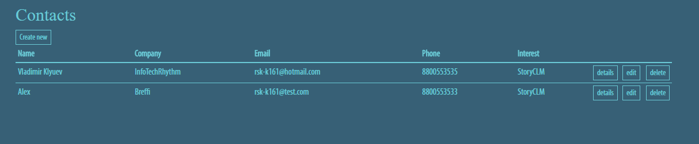
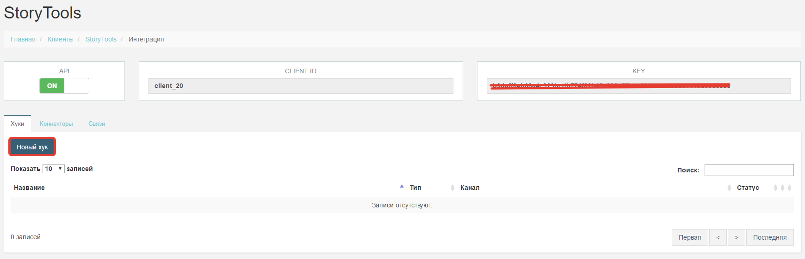

# Пример интеграции StoryCLM и приложения на ASP.NET Core на основе StoryCLM Hooks

## Общие положения
Интегрируются  StoryCLM и Web приложение на ASP.NET Core. Web приложение - сервис, накапливающий информацию о клиентах. Приложение имеет функционал по добавлению нового клиента базу данных, редактирования и удаления. Сайт доступно по адресу http://integrationsample.azurewebsites.net/contacts.

Web приложение состоит из нескольких разделов:
 1. Таблица.
 2. Форма создания нового контакта.
 3. Форма редактирования контакта.
 4. Форма удаления контакта.
 5. Форма просмотра контакта.

### Таблица

Таблица содержит все контакты добавленные в  базу данных ранее. Это главный вид приложения. Из него можно перейти в другие разделы: создания, редактирования, просмотра и удаления.

**Форма создания нового контакта.**

Дает возможность, заполнив поля формы, добавить новый контакт в базу данных.

**Форма редактирования контакта.**

Эта форма позволяет редактировать уже имеющийся контакт.

**Форма удаления контакта.**

Подтверждение удаление контакта.

**Форма просмотра контакта.**

Содержит детальную информацию о контакте, включая идентификатор записи и внешний ключ.

## Технически аспекты

Web приложение написано на Typescript и C# и реализует стек технологий ASP.NET Core для серверной части и Angular 2 для клиентской. В качестве хранилища контактов используется база данных SQLite. 
Принципиальная схема работы приложения:

Согласно схеме приложение  состоит из трех слоев:
  1. Клиентская часть, реализованная на Angular 2.
  2. Серверная часть - приложение ASP.NET Core.
  3. База данных - SQLite.

Все три слоя используют одну общую сущность - "Contact". Сущность представляет из себя объект и содержит следующие поля:
   1. Id - идентификатор в базе данных SQLite;
   2. _id - внешний ключ;
   3. Name - имя;
   4. Company - название компании;
   5. Email -  почта;
   6. Phone - контактный телефон;
   7. Interest - продукт, который интересен клиенту;

Для клиентской и серверной части "Contact" - это класс, а для слоя данных, модель "Contact" - это запись в таблице "Contacts" базы данных SQLite .
 
ASP.NET приложение содержит контроллер - ContactsController, реализущий  REST сервис для клиентского приложения. Контроллер включает методы:
  1. Get - возвращает список Contacts.
  2. Post - добавляет объект Contact в базу данных.
  3. Put - редактирует объект Contact по идентификатору.
  4. Delete - удаляет объект по идентификатору.

Web приложение состоит из компонентов-видов, модуля Contacts и сервиса ContactsService. Компоненты-виды осуществляют вывод разметки пользователю, модуль Contacts управляет состоянием приложения  а  ContactsService , используя Ajax, обращается к REST сервису на ASP.NET Core и осуществляет обмен данными. Клиентское и серверное приложения обмениваются данными в формате Json по протоколу HTTP. ASP.NET Core приложение и SQLite база данных взаимодействуют по средствам драйвера Entity Framework.

Пользователь, заполнив форму на клиентской стороне, создает сущность Contact на языке Typescript. Angular 2 приложение, используя Ajax, отправляет по протоколу HTTP сущность Contact, предварительно сериализовав ее в json объект. ASP.NET Core приложение обрабатывает запрос, десериализует json объект в объект Contact на языке c# и, используя драйвер, сохраняет этот объект в базу данных. По похожему принципу происходит редактирование и удаление объектов.

## Интеграция

Web приложение имеет базу данных, содержащую контакты. Задача интеграции в том, что бы StoryCLM имела актуальную версию этой базы данных. Следует отметить, что изменения могут производится как на стороне web приложения так и на стороне StoryCLM путем редактирования записей в таблице. Это означает, что синхронизация должна производится в обоих направлениях. Дополнительное требование - web приложение и StoryCLM должны обмениваться данными асинхронно и в реальном времени, что бы изменения появлялись мгновенно в обоих базах. Следовательно, web приложение должно как отправлять данные в StoryCLM, так и получать.  В таком случае,  приложения обмениваются данными по средствам отправки друг другу сообщений. В данном случае используется подход к интеграции на основе Web Hooks:

Более подобную информацию, о Hooks в StoryCLM можно найти в разделе документации.

Для того что бы реализовать интеграцию web приложения и StoryCLM на основе Hooks нужно:

  1. Создать в StoryCLM таблицу "Contacts", где будут хранится объекты типа Contact web приложения.
  2. Настроить Hooks в StoryCLM.
  3. Модифицировать код web приложения таким образом что бы оно могло принимать и обрабатывать сообщения от StoryCLM, так же само отправлять данные в StoryCLM при изменении данных в базе SQLite.

### Создание таблицы.

Таблицы - это реляционное хранилище данных.
Более подробная информация содержится в разделе "Таблицы" документации.

StoryCLM должна иметь актуальную версию базы данных web приложения. Для этого нужно создать таблицу "Contacts", в которой будут храниться объекты типа Contact.

Что бы создать таблицу, в текущем клиенте на панели администрирования нужно выбрать раздел "Таблицы" в главном меню.

Далее кликнуть по кнопки "Создать таблицу" в разделе "Таблицы".

При создании таблицы создается схема будущей таблицы. Схема должна соответствовать полям объекта Contact web приложения.

После создания, новая таблица появится в таблице "Таблицы".

Таблица готова получать данные из web приложения.

### Настройка StoryCLM Hooks.

Для того, что бы StoryCLM могла отправлять и получать сообщения реплики от web приложения необходимо создать два хука - входящий и исходящий.
Хуки находятся в разделе "Интеграция" клиента.

Для того что бы создать новый хук, нужно во вкладке "Хуки" кликнуть по кнопке "Новый хук".

**Входящий хук**

Более подробную информацию о входящих хуках можно у знать в документации (ссылка).

Входящий хук будет получать сообщения от web приложения по протоколу HTTP в канал "Tables". Обрабатывать данные будет таблица "Contacts". Название хука - "Contacts_IN".

После создания, новый хук, получит URL на который web приложение будет отправлять POST запросы. Что бы узнать URL нужно перейти в хук, кликнув по названию хука.

В тайле "URL" находится URL который будет использовать web приложение для отправки сообщений StoryCLM.

**Исходящий хук**

Более подробную информацию о исходящих хуках можно у знать в документации (ссылка).

Исходящий хук будет отправлять сообщения web приложению в канал HTTP на указанный URL при возникновении событий добавления, редактирования и удаления записей в таблице "Contacts".

В результате получатся два хука, которые будут полчать и отправлять данные в web приложение.

### Модификация web приложения

Модификация касается только ASP.NET Core часть web приложения.

Исходя из настроек Hooks StoryCLM, система будет посылать web приложению сообщения в формате JSON по протоколу HTTP на указанный в настройках исходящего хука URL. Структура данных определяется событием которое запустит хук. В данном случае - это события: insert, update, delete. Подробнее о событиях и данных которые эти события генерируют можно узнать в соответствующем разделе документации (). В конкретном случае, StoryCLM при возникновении события будет отправлять данные на URL: https://integrationsample.azurewebsites.net/api/contacts/notifications.  В web приложении нужно создать метод Notifications в контроллере Contacts который будет принимать json данные методом POST и производить обработку.

 При изменении данных в web приложении, необходимо посылать реплики в StoryCLM что бы синхронизировать базы. Исходя из настроек входящего хука, система будет принимать данные по протоколу HTTP методом POST на URL https://api.storyclm.com/v1/webhooks/590b1a02bc977d176ce11ffd/824ae822317e4d859d5dfd3d73b7fec3. Согласно настройки входящего хука, данные пришедшие от web приложения будут поступать в канал Tables и обрабатываться таблицей Contacts. Подробнее о каналах входящих хуков, о канале Tables, о формате данных который он получает можно узнать их раздела документации. Следовательно, нужно изменить методы REST API web приложения таким образом, что бы каждый раз при изменении данных приложение отправляло StoryCLM сообщения, которые могли бы изменить данные в таблице Contacts StoryCLM.

Новая схема:

Необходимые изменения:

1. Получение и обработка сообщений от StoryCLM.
2. Отправка сообщений в StoryCLM.

Получение и обработка сообщений от StoryCLM.
Метод Notifications в контроллере Contacts принимает сообщения от StoryCLM. Метод обрабатывает три вида сообщений-событий:

  1. Insert. Добавление нового объекта в таблицу. Сообщение сериализуется в объект Contact добавляется в базу данных SQLite, при этом запись получает уникальный идентификатор id. После чего, объект нужно "вернуть" в StoryCLM. Дело в том, что когда в StoryCLM создается объект у него нет id, так как это идентификатор записи в базе данных web приложения. Он появляется только тогда когда запись Contact добавят в SQLite. Следовательно, после того как запись была создана в локальной базе, нужно обновить эту запись в таблицах StoryCLM, послав соответствующее сообщение. Без этого не будет возможна синхронизации в дальнейшем.
  2. Update. Редактирование существующего объекта. Сообщение сериализуется в объект Contact. По полю id происходит поиск записи в локальной базе. Далее происходит мердж и запись обновляется.
  3. Remove. Удаление существующего объекта. Сообщение сериализуется в объект Contact. По полю id происходит поиск записи в локальной базе. Далее происходит удаление записи.

Отправка сообщений в StoryCLM.
В существующие методы нужно добавить код, который будет отправлять сообщения StoryCLM для синхронизации:

  1. Post - добавляет объект Contact в базу данных. После добавление, у объекта Contact будет отсутствовать поле _id. _id - это уникальный идентификатор объекта в таблицах StoryCLM. Необходимо добавить новую запись в таблицу, послав сообщение. В ответе от системы будет объект Contact с присвоенным _id. Нужно обновить запись в локальной базе данных добавив полне _id
  2. Put - редактирует объект Contact по идентификатору.
  3. Delete - удаляет объект по идентификатору.

