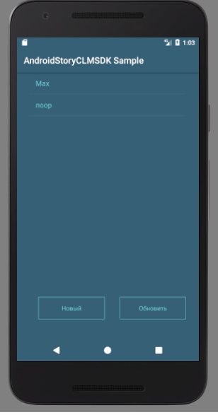
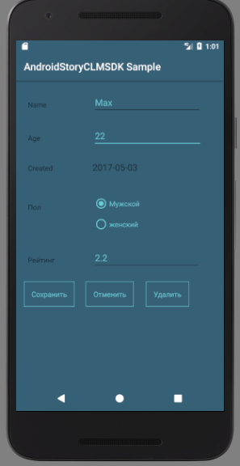

## Пример интеграции приложения на платформе Android с системой StoryCLM
В данном каталоге представлен пример мобильного приложения на платформе Android, реализующего доступ к REST API StoryCLM. Для интеграции используется библиотека [StoryCLM Java SDK](https://github.com/storyclm/Java-SDK). По данной ссылке описано подключение библиотеки.

Приложение представлено двумя страницами (activity). Главная страница отображает список профилей, хранящихся в таблице StoryCLM. Для просмотра детальной информации необходимо выбрать профиль из списка или нажать кнопку "Новый" для создания нового объекта.

Вторая страница служит для отображения и редактирования детальной информации о профиле. 
Она используется также для создания нового профиля, и удаления существующего.

[StoryCLM Java SDK](https://github.com/storyclm/Java-SDK) используется в качестве высокоуровневой библиотеки доступа к объектам таблицы (в примере в качестве таких объектов выступают объекты класса Profile).  Для получения коннектора используем фасадный метод с указанием аутентификационных данных, которые находятся в файле настроек res/values/strings.xml.

     StoryCLMServiceConnector clientConnector =  StoryCLMConnectorsGenerator.GetStoryCLMServiceConnector(App.getContext().getResources().getString(R.string.client_id),App.getContext().getResources().getString(R.string.client_secret),null);

Для работы с таблицей необходимо получить типизированный сервис, указав идентификатор таблицы и тип объектов, с которыми будет манипулировать сервис (в примере данный тип представлен классом Profile).

    StoryCLMProfileService = clientConnector.GetTableService(Profile.class, 23);

Далее все операции над объектами (получение, вставка, обновление и удаление)  таблицы осуществляются с помощью полученного сервиса. 

В представленном примере используется только асинхронная версия методов сервиса, т.к. платформа Android запрещает доступ к сети в потоке, в котором работает пользовательский интерфейс. Например, для получения списка объектов используется код:

       final IAsyncResult sizeresult = getService().FindAll(null,50);
                sizeresult.OnResult(new OnResultCallback() {
                    @Override
                    public void OnSuccess(Object o) {
                        profiles = ((List<Profile>) o).toArray(new Profile[size]);
                        initByProfiles();
                        ((Button) findViewById(R.id.RefreshButton)).setEnabled(true);
                        findViewById(R.id.loadingPanel).setVisibility(View.GONE);
                    }

                    @Override
                    public void OnFail(Throwable throwable) {
                        Toast.makeText(getBaseContext(), "Ошибка сети. Повторите операцию. ", Toast.LENGTH_LONG).show();
                        ((Button) findViewById(R.id.RefreshButton)).setEnabled(true);
                        findViewById(R.id.loadingPanel).setVisibility(View.GONE);
                    }
                });