## Пример интеграции StoryCLM и CRM SalesForce с помощью Apache Servicemix

## Интегрируемые системы

**StoryCLM** — разработанная BREFFI диджитал-платформа, позволяющая создавать интерактивные презентации c возможностью получения моментальной обратной связи.

**CRM Salesforce** - облачная платформа, включающая набор инструментов и инновационных разработок, предназначенных для автоматизации стратегий взаимодействия с клиентами. Мировой лидер SaaS-сервисов для бизнеса. 

**Apache Servicemix** - пакет для создания композитных приложений, базирующийся на концепции корпоративной сервисной шины и комбинирующий сервис-ориентированную архитектуру и событийно-ориентированная архитектуру.
Cоставной частью Servicemix является интеграционный фрэймворк Apache Camel. 

**Apache Camel** - открытый кроссплатформенный java-фреймворк, который позволяет проводить интеграцию приложений в простой и понятной форме. Идеологически основан на Шаблонах Интеграции Корпоративных приложений.
В комплекте с Apache Camel идет оргомное множество компонентов, предоставляющих доступ к стандартным протоколам или конкретным системам. Это позволяет легко организовывать взаимосвязь между несколькими системами в кратчайшие сроки. 

## Стратегия интеграции

**Постановка задачи**

Задача заключается в хранении актуальной информации об определенных сущностях системы Salesforce в таблицах StoryCLM . Устаревание данных не должно составлять более 24 часов. Список синхронизируемых сущностей может изменяться.

**Схема решения**

Salesforce имеет ограничение на количество вызвов API в сутки. В связи с эти для уменьшения нагрузки принято решение производить репликацию несколько раз в сутки по расписанию.

Архитектура процессов интеграции выглядит следующим образом:

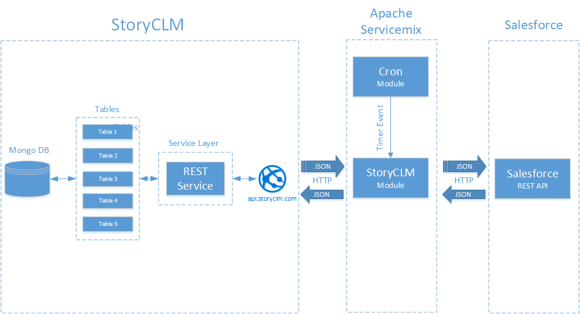

Servicemix выступает посредником в процессе интеграции. Посредством разработанного модуля в нем производятся основные процессы репликации: инициализация по расписанию, получение, обработка, фильтрация и отправка данных каждой системе путем вызова сервисов API. 
Доступ к API каждой системе осуществляется посредством протокола HTTP. При этом для доступа к StoryCLM используется REST, в то время как к Salesforce в первом примере применяется REST, а во втором - SOAP.
Конечные системы пассивно обрабатывают запросы от Servicemix.

**Описание разработанного модуля для Apache Servicemix**

Для Servicemix представлено 2 примера модуля интеграции StoryCLM  и CRM Salesforce:

* Пример 1 - [StoryCLMCamelComponent]() - реализация интеграции средствами Apache Camel на языке Blueprint XML, подразумевающего описание процесса репликации в файле xml  (проект [SalesforceStoryCLMIntegration]()). 
 
    При этом для доступа API StoryCLM был разработан компонент Camel [StoryCLM Camel Component](). Доступ к API Salesforce осуществляет официальный компонент [Camel Salesforce component](). Весь алгоритм репликации описан в файле [blueprint-bean.xml]() и кратко обрисован на следующей диаграмме:

    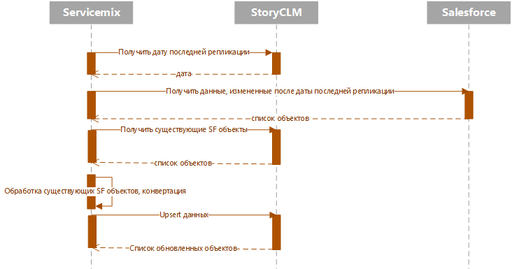
    
* Пример 2 - [ReplicatorBean]() - реализация интеграции в нативном Java классе  [Replicator]() (проект [Salesdforce2StoryReplicator]()) с последующим встраиванием в инфраструктуру Apache Camel (проект [Salesforce2StoryCamel]()).

  Для доступа к таблицам StoryCLM используется библиотека [stroryclmsdk](), в то время как  доступ к Salesforce осуществляется библиотеками force-partner-api-40.0.0 и force-wsc-40.0.0. Все части примера ReplicatorBean кроме Salesforce2StoryCamel не зависят от контекста Camel, в связи с этим могут использоваться в любой инфраструктуре.

**Сервисная архитектура**

Apache Servicemix поддерживает сервис-ориентированный процесс взаимодействия различных приложений. Далее описаны принципы и причины образования сервисов в модуле интеграции.

Ниже приведена упрощенная диаграмма классов второго примера [ReplicatorBean]().
   
   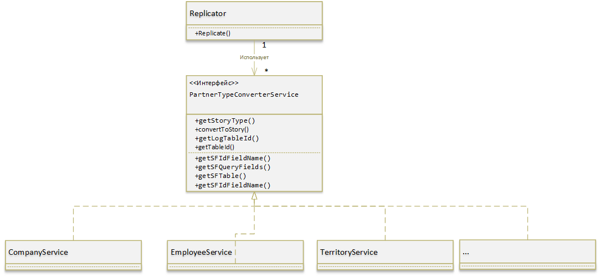

Как отмечалось выше в данном примере алгоритм репликации реализован в отдельном классе Replicator (проект [Salesdforce2StoryReplicator]()). Данный класс выполняет высокоуровневые операци по перемещению данных.  При этом детали реализации конвертации и конфигурация доступа для различных сущностей вынесены в интерфейс [PartnerTypeConverterService](). Для каждой реплицируемой сущности необходимо предоставить один объект с данным интерфейсом. На диаграмме классов выше видно, что Replicator использует список таких объектов. 

Так как Apache Servicemix предоставляет OSGI контейнер, примеры реализованы как совокупность OSGI бандлов. Объекты, реализующие интерфейс  [PartnerTypeConverterService]() регистрируются как сервисы. Основное приложение [Salesforce2StoryCamel]() использует список зарегистрированных сервисов для передачи его классу [ReplicatorBean](). 

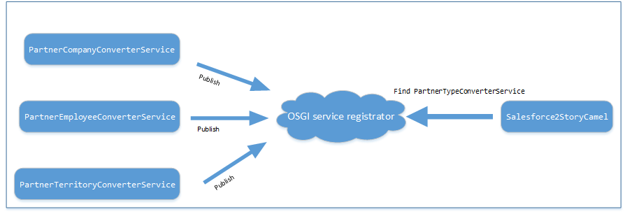

Для того чтобы добавить репликацию еще одной сущности необходимо реализовать для нее интерфейс [PartnerTypeConverterService]() и зарегистрировать в качестве сервиса. Примеры можно рассмотреть в проектах [PartnerEmployeeConverterService](), [PartnerCompanyConverterService]() и [PartnerTerritoryConverterService]().

## Настройки интеграции

**Настройка Salesforce**

Для настройки интеграции на стороне SF необходимо:
1.	Создать пользователя с доступом к API системы и правами на редактирование соответствующих сущностей.
2.	Установить пакет интеграции.

Далее по пунктам.

**Шаг 1. Создание пользователя**
1.	Переходим в настройки нажав на ссылку «Настройки» («Setup») в правом верхнем углу
2.	Выбираем в левом меню «Администрировать-Управление пользователями-пользователи»
3.	Нажимаем кнопку «Создать пользователя» 

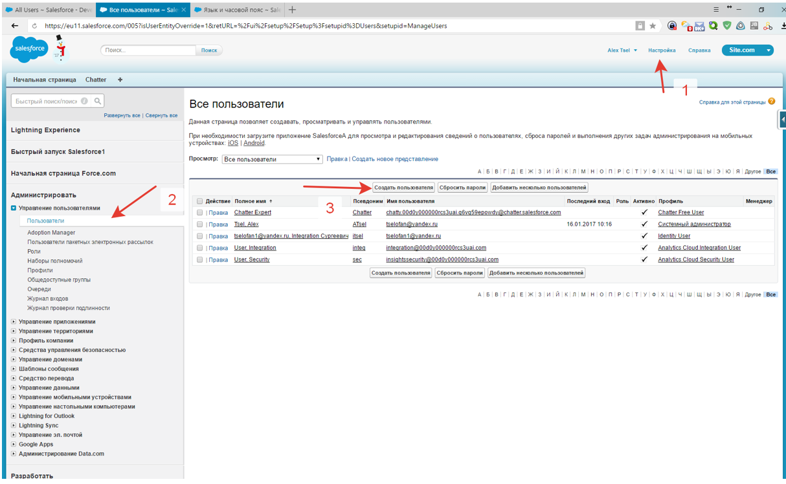

4.	Заполните поля как указано на рисунке ниже. На изображении приведен пример заполнения информации о пользователе. Если на момент заполнения имеются некоторые договоренности или корпоративные правила, следует пользоваться ими. Необходимое требование – профиль пользователя должен содержать отмеченный пункт «Полномочия администратора - API включен».

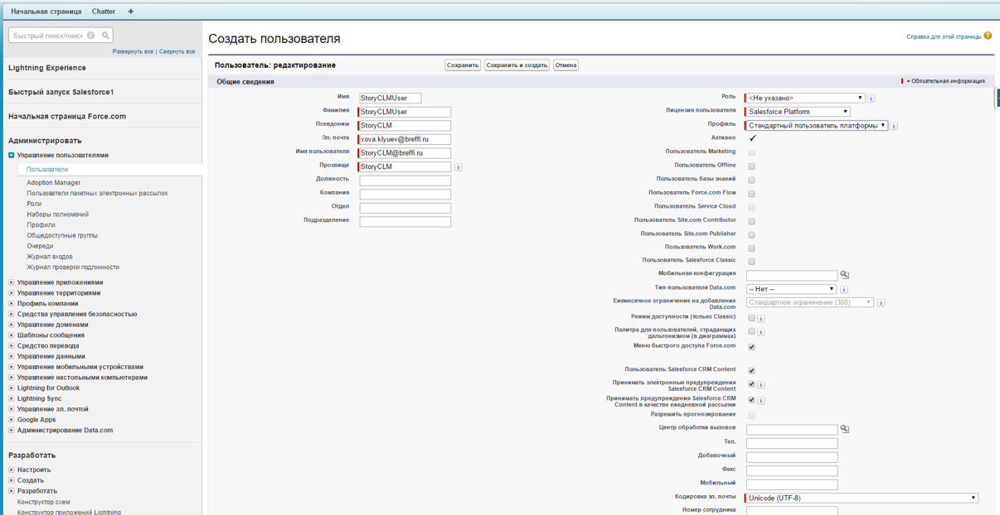

**Шаг 2. Установка пакета интеграции**

Пакет интеграции представляет собой набор предустановок для взаимодействия сервера SF c системой StoryCLM. Он избавляет от нескольких рутинных шагов по настройке SF.
1.	Пройдите по ссылке
https://login.salesforce.com/packaging/installPackage.apexp?p0=04t0Y000000ekHF 
2.	Запустится процесс установки пакета интеграции в браузере. Портал Salesforce.com может потребовать аутентификацию – необходима учетная запись администратора.
3.	После установки пакета необходимо смягчить ограничения на IP-адреса. Перейдите в форму редактирования приложения (рисунок ниже)
Connected apps

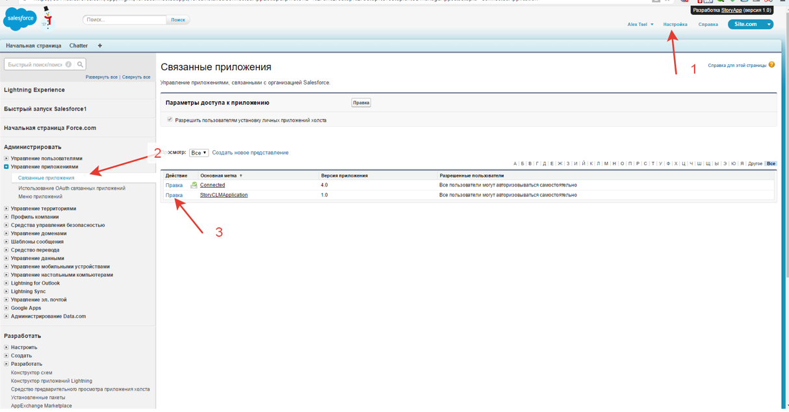

4.	Установите значение «Смягчить ограничения IP-адресов» (рисунок ниже)

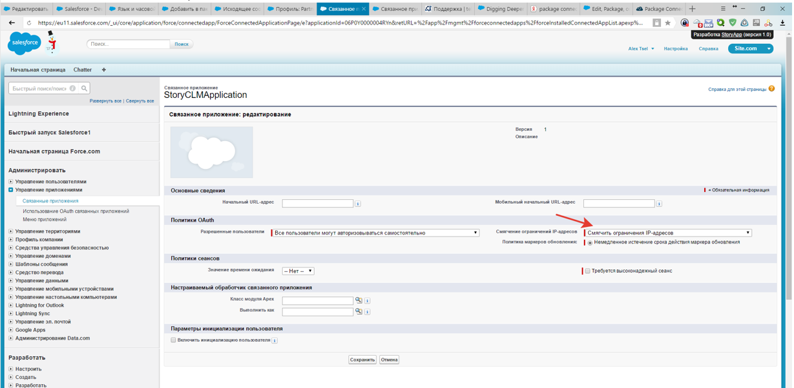

Настройка SF окончена.

**Настройка StoryCLM**

Для доступа к REST API StoryCLM необходимо активировать API в административной панели раздела интеграция. В этом же разделе необходимо взять аутентификационные данные для настройки модуля servicemix.

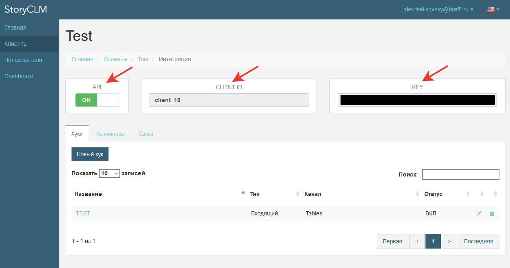

Для репликации каждой сущности необходимо создать 2 таблицы в StoryCLM: одна непосредственно для данных, вторая используется как журнал для получения времени последней синхронизации. 
Схема таблицы с данными может иметь произвольный тип - под нее создается класс синхронизации в модуле Servicemix. Например, создание таблицы для хранения информации о компаниях происходит в разделе "Таблицы" и имеет следующий вид: 

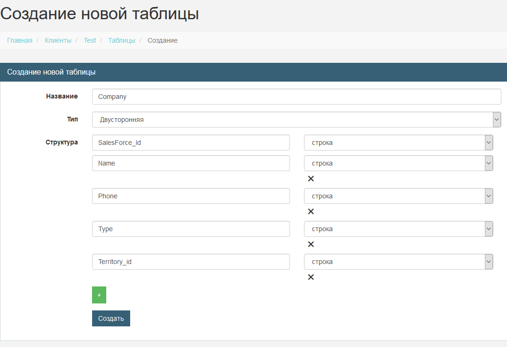

Схема таблицы журналирования должна иметь следующий вид:

       {
          "Type": 0,
          "Name": "Имя журнала",
          "Schema": [
            {
              "k": "Date",
              "t": 5
            },
            {
              "k": "Updated",
              "t": 2
            },
            {
              "k": "Inserted",
              "t": 2
            },
            {
              "k": "Deleted",
              "t": 2
            },
            {
              "k": "Errors",
              "t": 1
            }
          ]
        }

Вы можете сохранить ее в файл и импортировать в таблицу для создания нового журнала, либо создать с помощью пользовательского интерфейса:

    
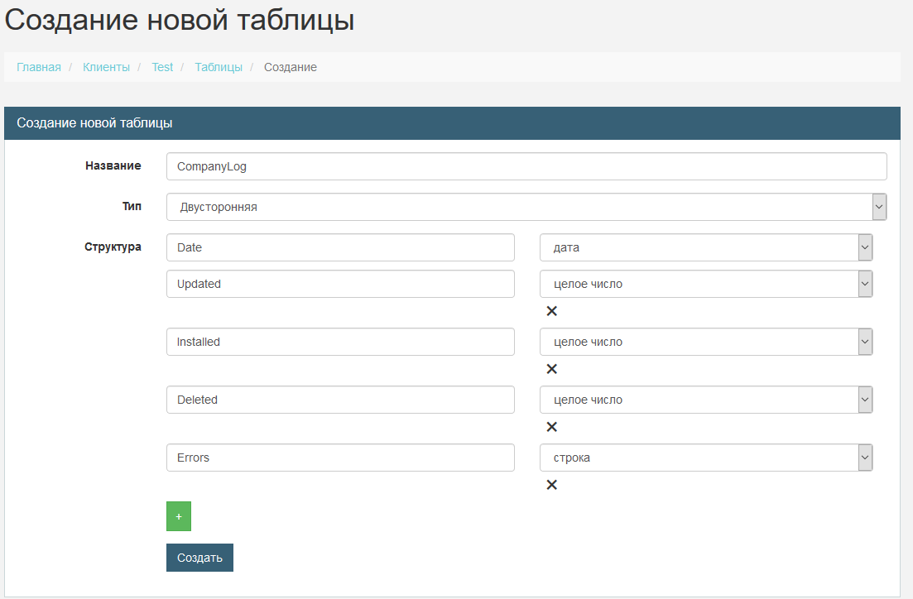

**Настройка модуля Apache Servicemix**

Настройка модуля Servicemix состоит из настроек основного приложенияи настроек сервисов.
Настройки основного приложения включают настройку расписания и аутентификационных данных. Настройки сервисов заключаются в указании идентификаторов таблицы с данными и таблицы журналирования:

    #Настройка расписания
    cron=0 0/1 * * * ?

    #Аутентификационные данные SalesForce
    loginUrl=https://login.salesforce.com
    userName=******
    password=******

    #Аутентификационные данные SalesForce
    clientId=********
    clientSecret=********

    #Настройки сервисов
    employeeTableId=36
    employeeLogTableId=43
 
    territoryTableId=24
    territoryLogTableId=42

    companyTableId=25
    companyLogTableId=41

